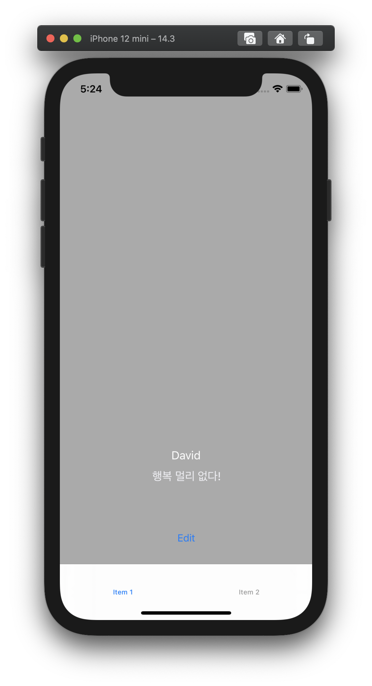
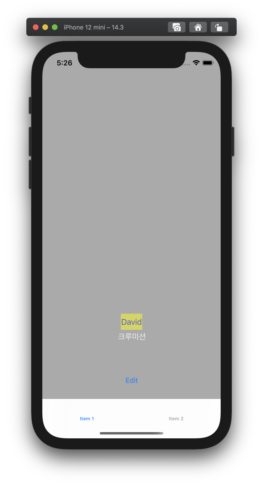
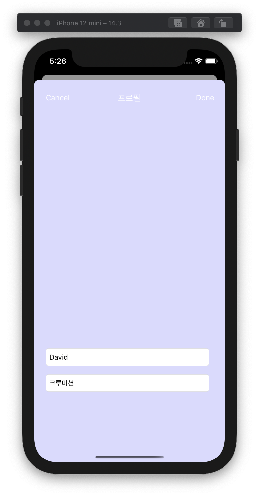
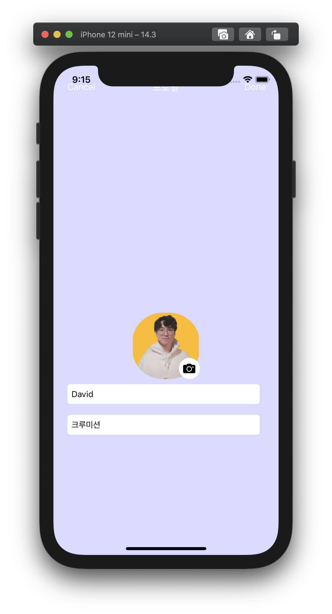
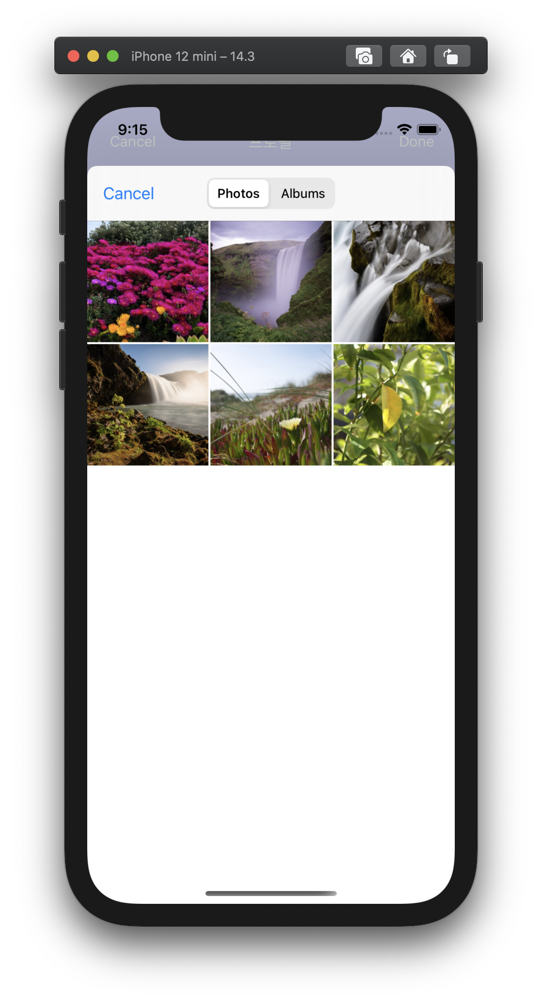
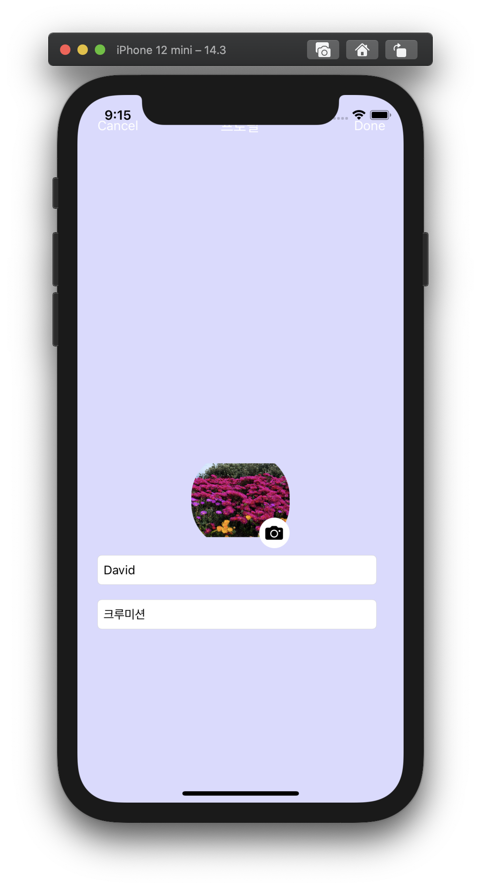

# swift-w2-profile
모바일 2주차 프로필 저장소

david의 README

### First Commit - 0111 18:00

- fork 및 clone
- KakaoProfile 프로젝트 생성
- TabBar Controller 추가
- 시뮬레이터 선택(iPhone 12 mini) 및 실행

### Second Commit - 0112 12:30

- InageView, Label, Button 추가

- ViewController에 IBOutlet으로 연결

- Label Text 추가, Label Attribute 변경

  

  

### Third Commit - 0112 13:30

- Button을 ViewController에 IBAction으로 연결
- 추가한 IBAction에 몇가지 속성 변경 코드 추가

### 4th Commit - 0112 17:30

- 새로운 ViewController Scene추가
- LoginViewController 생성
- 이전 Scene의 Edit 버튼과 새로 만든 Scene을 Segue로 연결
- 새로운 Scene에 Label, Button, TextEdit, 추가
- Cancel 버튼 기능 추가

### commit : upload image in imageView

### commit : addProfileChangeButton

### commit : UIImagePickerController - 0113 21:00

- declare a variable of instance of UIImagePickerController
- Edit View Controller adopts two protocols : UINavigationControllerDelegate, UIImagePickerControllerDelegate
- make IBAction of camera button that can configure and call UIImagePickerController
- add two methods
  1. imagePickerController
  2. imagePickerControllerDidCancel

### commit : Done Button

- make protocol : ProfileDoneDelegate
- delcare protocol variable in EditViewController
- make IBAction : doneButtonTouched
- ViewController adapts protocol : ProfileDoneDelegate
- ViewController implements method : UpdateProfile