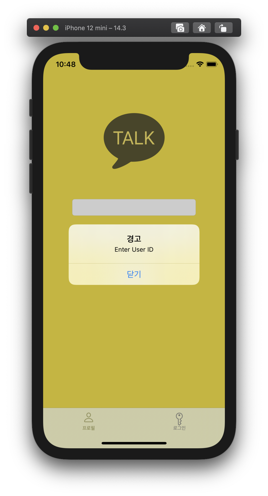

# swift-w2-profile
모바일 2주차 프로필 저장소

david의 README

### First Commit - 0111 18:00

- fork 및 clone
- KakaoProfile 프로젝트 생성
- TabBar Controller 추가
- 시뮬레이터 선택(iPhone 12 mini) 및 실행

### Second Commit - 0112 12:30

- InageView, Label, Button 추가

- ViewController에 IBOutlet으로 연결

- Label Text 추가, Label Attribute 변경

  

  

### Third Commit - 0112 13:30

- Button을 ViewController에 IBAction으로 연결
- 추가한 IBAction에 몇가지 속성 변경 코드 추가

### 4th Commit - 0112 17:30

- 새로운 ViewController Scene추가
- LoginViewController 생성
- 이전 Scene의 Edit 버튼과 새로 만든 Scene을 Segue로 연결
- 새로운 Scene에 Label, Button, TextEdit, 추가
- Cancel 버튼 기능 추가

### commit : upload image in imageView

### commit : addProfileChangeButton

### commit : UIImagePickerController - 0113 21:00

- declare a variable of instance of UIImagePickerController
- Edit View Controller adopts two protocols : UINavigationControllerDelegate, UIImagePickerControllerDelegate
- make IBAction of camera button that can configure and call UIImagePickerController
- add two methods
  1. imagePickerController
  2. imagePickerControllerDidCancel

### commit : Done Button

- make protocol : ProfileDoneDelegate
- delcare protocol variable in EditViewController
- make IBAction : doneButtonTouched
- ViewController adapts protocol : ProfileDoneDelegate
- ViewController implements method : UpdateProfile

### commit : Embed a Navigation Controller

- Embed a Navigation Controller in tem2

  

  ### commit : make LoginViewController
  
  - make LoginViewController.swift
  - set the controller as the Cunstom class of Navigation Controller
  
  
  
  ### commit : Add some elements
  
  - add Image
  - add TextField
  - add Button
  
  
  
  ### commit : connect IBOutlet
  
  - messageImage
  - messageText : for setting zindex
  - inputId
  - inputPassword
  
  ### commit : make Main View
  
  - make Main View Controller Scene
  - make MainViewController.swift
  - set the controller as custom class
  - using segue, push MainView when the button touched
  
  ### commit : WKWebView
  
  - fulfill the MainViewController with WebKit WebView
  - using WKWebView object, present web page into app's UI
  
  
  
  
  
  ### commit : some modification
  
  - naviBar hidden on/off
  - add naviBar Title
  
  
  
  
  
  ### commit : modify the method that changes ViewController
  
  - change the method from segue to IBAction in order to implement the login logic

### commit : add Login Logic

- compare id and password with target string
- if valid, push MainViewController
- if not valid, present alert.
- set isSecureTextEntry property of inputPassword to true

### commit : modify : tab bar

- modify tab bar icon
- modify tab bar title

### commit : Remake Login Logic

- make enum VaildateType
- make method : validateAccount()
- make method : ShowAlert

### commit : feedback -> modify

- early exit
- delete unused method
- remake useless hard codes
- call method of super class when overriding

### commit : Some Change

- make WEWebView
- connect the view using IBOutlet
- add back button in that WEWebView

